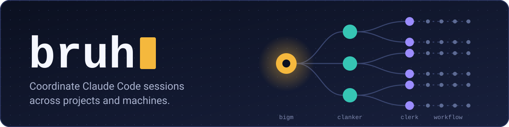

<p align="center">
  
</p>

<p align="center">
  <a href="https://github.com/oter/bruh/actions/workflows/ci.yml"></a>
  <a href="https://github.com/oter/bruh/releases/latest"></a>
  <a href="LICENSE"></a>
  <a href="https://scorecard.dev/viewer/?uri=github.com/oter/bruh"></a>
</p>

# bruh

bruh is a Claude Code plugin. It lets one person run work in many projects on many machines through a hierarchy of Claude Code sessions.

You talk to one session, bigm. bigm keeps the status of all work in a private ledger repository and answers your questions about it. It shows you only the questions that need you. The file `mode.md` of the ledger sets the mode: `human` (bigm asks you) or `autonomous` (bigm decides P1 questions itself and records each decision).

## Roles

| Role | Lifetime | Started by | Scope | Does hands-on work |
|---|---|---|---|---|
| bigm | Long-lived | You | All projects. Keeps the ledger and the "Owed to owner" list. | No |
| Clanker | Long-lived | bigm | One project. Knows the full picture of that project. Divides the work into tasks. | No |
| Clerk | One task | A clanker | One task. Starts workflows, pushes the branch, and reports with evidence. A scout clerk reads the sources for one question, may clone a public repository or download files into `/tmp` for research, and reports each fact with its source. | No |
| Workflow | One run | A clerk | One step of a task: plan, implement, review, and fix. | Yes |

Each role runs as a plugin agent (`bruh:bigm`, `bruh:clanker`, `bruh:clerk`). The work runs in the `/bruh:deliver` workflow.

## How it works


- A local message goes to the durable mailbox of the bruh MCP server. A `SendMessage` nudge carries only its header line.
- Each question has a priority. A clanker answers P2 questions from the project context. It also answers the P1 classes that you delegate to it in `priorities.md`. The other P1 questions (your decisions) and all P0 questions (blocks that only you can remove) go to bigm, and bigm shows them to you.
- Each question to you is a question file first, also each ask of bigm itself and each question that bigm relays, so the `/bruh-board` pane shows it with its options as buttons (see "Watch bruh work"). A select of bigm in the terminal is a copy of an open question and names its `Q-<id>`: the hook `owner-ask.sh` blocks every other select of bigm. bigm puts what waits on you last, in its status report ("Ready for you", "In progress", "Waiting on you") and in its replies.
- On a model with a 1M context window, each role stays below about 55 percent of its context window. A hook tells the role to write its handoff before compaction, and another hook gives the handoff back after compaction.
- A remote clanker talks to bigm through the Orca remote runtime.

The full process is in [docs/flow.md](docs/flow.md) as diagrams.

## Implement and review

The skill `/bruh:implement` is the procedure for each code change and each review. The orchestrating session does not edit code. An implementer agent writes the change from a brief, and a separate reviewer agent checks it with the review guides, in a fix loop. For a settled spec with many changes, the skill uses four workflows:

| Workflow | What it does |
|---|---|
| `/bruh:tickets` | Breaks a settled spec into function-sized TDD tickets and execution waves, reviewed in a fix loop |
| `/bruh:implement-tickets` | Implements the tickets wave by wave, in parallel lanes (`scripts/lane.sh`), with a reviewer for each ticket and a whole-branch gate |
| `/bruh:review-and-fix` | Reviews an own change with several lenses and the gates, refutes each finding, and fixes the confirmed findings one area at a time |
| `/bruh:review-only` | Reviews and refutes a pull request of another author, and changes nothing |

No workflow posts on a pull request. A workflow returns its findings. After your yes, they are posted with plain `gh pr review --comment --body-file <file>` on GitHub or `glab mr note create` on GitLab. For a self-hosted server, the `--repo` value names the host. In a role session, a clerk saves the result with the MCP tool `result_save` and posts only with your approval, which bigm relays as `ANSWER Q-<id>: post <owner/repo>#<number> at <head SHA> approved`, or under a post grant in `grants.md` of the ledger. Each post ends with the marker line `<!-- bruh:<role key> -->`.

In a role session, a clerk runs the skill. In your own session, you are the orchestrator: start with `/bruh:implement` and answer the questions of the session.

## Install

Steps 4, 5, and 6 are optional. Create the ledger repository (step 2) before you run the init skill (step 3).

### 1. Install the plugin

```bash
claude plugin marketplace add oter/bruh
claude plugin install bruh@oter
```

Install at user scope, so that all your projects get the plugin.

The install dialog asks the plugin options, among them your name (how bruh addresses you), the handoff threshold, and the busy clerk cap. The title of each option starts with "bruh: ". To change an option later, use `/config`. The init skill does not ask these options.

Local sessions in Orca: with the option `orca_local` at `auto` (the default) and the Orca app running, each local clanker and clerk gets an Orca tab with its role key as the title. The tab runs `claude attach <short ID>`, so it shows the background session, and the session keeps running when you close the tab. The tab opens only in a repository that Orca knows: the trust step of the init skill offers to add your repositories to Orca. bruh finds the Orca CLI through `ORCA_CLI_COMMAND`, else `orca-ide` on Linux, else `orca`. On Linux it never runs a bare `orca`, which is the screen reader. With `off`, or without Orca, bruh runs no `orca` command, and the sessions run with `claude --bg` only. Details are in [spec section 4.3](docs/spec.md#43-local-sessions-in-orca).

### 2. Create the ledger

The ledger is Markdown in a separate private repository. It describes all your other repositories. Create it before you run the init skill:

```bash
gh repo create <owner>/<ledger repository> --private --clone
```

When the folder is empty, the init skill creates the layout: `README.md`, `mode.md`, `priorities.md`, `rules.md`, `grants.md`, `questions.md`, `owed.md`, `leases.md`, and `projects/`. It also writes `.claude/settings.json`, the start settings of bigm (step 7), and `learn/` for the projects that you select.

`learn/` is the index of your projects. `learn/tree.json` has the folder tree and the scan settings. `learn/projects/<key>.json` has the purpose, the repositories, the links to other projects, and the doc pointers of one project. The index has no build or test commands, because the repository holds them: a clanker learns them from the repository when the work starts.

The Markdown files hold only the current state. When an item closes, bigm deletes its row in the commit that closes it, with the subject `close <kind>: <subject>`. Git is the history: `git log --grep` finds each closed item.

bigm writes the Markdown files. It changes a table row or a key line with the tool `ledger_edit`, which commits that file and writes the DONE mail to the ledger clerk. The waiter of the ledger clerk wakes it on that mail, so bigm sends no nudge. Plugin code writes `learn/` (the init skill, and the refresh at each sweep of bigm). The init skill writes `.claude/settings.json`. bigm is the only role that commits the ledger. The ledger clerk pushes the ledger after each commit of bigm.

### 3. Run the init skill

Run the init skill from a session with no role key: `claude --setting-sources user` in the ledger folder, or a Claude Code session in another folder. A plain `claude` in the ledger folder is bigm (step 7), and the skill stops there. This is also true for a second run.

```text
/bruh:init
```

Each step tells what its answer controls. Each question with fixed answers is a select, with the default first. The steps:

- Ledger: select the ledger folder of step 2, or type its path.
- Settings: the mode (human or autonomous), the P1 batch interval and size, the review-round cap, and "defaults for the rest" or "customize" (the auto-compact window, the status line tap, and the channels).
- Root: the folder of your repositories, default `~/workspace`.
- Hosts: the kind of each code host that bruh cannot find (GitHub, GitLab, or Gitea), and the real host of each SSH host alias that does not resolve.
- Pick: select the groups and the repositories, with their activity on the code host. Then accept, split, join, or skip each proposed project.
- Learner: one read-only agent `bruh:learner` for each project reads its files, and proposes the purpose, the links to other projects with the evidence file and line, the doc pointers, and the host of each SSH host alias that did not resolve.
- Confirm: accept, edit, or skip each proposed value.
- Diff: the skill shows the full diff of the files outside the ledger and of `<ledger>/.claude/settings.json`, and a table of the ledger part: the project key, the purpose, the repositories, the links, and the docs. Select "show all" to see the full diff of the ledger part. The skill writes nothing before your yes.
- Trust: the skill lists each selected repository, with a mark when it has `.claude/settings.json` or `.mcp.json`. Select "now" or "at the first work". "Now": start `claude` once in each folder, accept the trust dialog, and quit with `/exit`. `claude --bg` refuses a folder that is not trusted. "At the first work": bigm sends you a P0 with the folder when a clanker cannot start there.

A second run asks first: "change projects" (add, remove, or learn again a project) or "change settings". bigm changes the mode and the P1 settings. Merge grants, delegated P1 classes, and remote machines are not init questions: tell them to bigm, and bigm records them in the ledger.

Non-interactive form, for a container or a script: write the answers to a JSON file, then run the init command of the MCP server. `<plugin root>` is the folder of the installed plugin, `~/.claude/plugins/cache/oter/bruh/<version>`. The MCP tool `bruh_info` also gives it.

```json
{
  "ledger_path": "/path/to/ledger",
  "mode": "human",
  "p1_batch_minutes": 60,
  "p1_batch_size": 5,
  "review_round_cap": 2,
  "root": "/home/me/workspace",
  "depth": 4,
  "exclude": ["archive"],
  "host_kinds": {"git.example.org": "gitea"},
  "host_aliases": {"gitlab.com-work": "gitlab.com"},
  "projects": [
    {
      "key": "auth",
      "repos": ["auth"],
      "main": "auth",
      "fills": [
        {"field": "purpose", "value": "Login service of the shop", "source": "owner"}
      ]
    },
    {
      "key": "shop",
      "repos": ["shop", "shop-app"],
      "main": "shop",
      "fills": [
        {"field": "purpose", "value": "Online shop: web client and Go API", "source": "agent"},
        {"field": "link", "value": "auth", "source": "agent", "repo": "shop", "file": "go.mod", "line": 5},
        {"field": "doc", "value": "README.md", "source": "agent", "repo": "shop"}
      ]
    }
  ],
  "user_name": "<how bruh addresses you>",
  "handoff_percent": 50,
  "max_busy_clerks": 8
}
```

```bash
GOTOOLCHAIN=local go run -C <plugin root>/mcp . init --answers "$PWD/answers.json"
```

Give the answers file as an absolute path. `go run -C` runs the program in `<plugin root>/mcp`, so a relative path does not point to your file.

Only `ledger_path` is required. Each path of `repos` and `main` is relative to `root`. The non-interactive form runs no learner: it takes the `fills` of each project as they are, and checks them. Without `projects`, init changes no project of the ledger. A container has no install dialog, so the keys `user_name`, `handoff_percent`, and `max_busy_clerks` set the plugin options there, and init writes only the options that the answers have. Instead of a file, you can set each key as an environment variable `BRUH_INIT_<KEY>`, for example `BRUH_INIT_ROOT=/home/me/workspace`. The values of `user_name`, `ledger_path`, `mode`, and `root` are text, and the other values are JSON. The non-interactive form prints the diff instead of asking.

### 4. Set up a channel (optional)

A channel sends P0 and P1 questions to your phone. A channel runs only when bigm starts with `--channels`.

Telegram uses the official channel plugin, which needs [Bun](https://bun.sh). Create a bot with BotFather and copy its token. Then, in a Claude Code session:

```text
/plugin install telegram@claude-plugins-official
/telegram:configure <token>
```

Start bigm with `--channels plugin:telegram@claude-plugins-official` (step 7). Send a message to your bot, then pair your account and allow only yourself:

```text
/telegram:access pair <code>
/telegram:access policy allowlist
```

Slack is a channel of bruh itself. During the channels research preview, a channel that is not on the Anthropic allowlist loads only with a development flag.

1. Create a Slack app for your own workspace at <https://api.slack.com/apps>. Do not distribute it: Slack gives an app that is distributed outside the Slack Marketplace only 1 read request each minute.
2. Add the bot token scopes `chat:write`, and `channels:history` for a public channel or `groups:history` for a private channel. Install the app, and copy the bot token (`xoxb-...`).
3. Create a channel for bruh, invite the app to it, and copy the channel ID. Copy your own Slack member ID from your profile.
4. Run `/plugin configure bruh` and set `slack_bot_token`, `slack_channel_id`, and `slack_owner_user_id`. Only messages from `slack_owner_user_id` reach bigm.
5. Start bigm with `--dangerously-load-development-channels plugin:bruh@oter` (step 7). When you also use Telegram, keep the `--channels` flag too.

The details are in [plugins/bruh/channels/slack/README.md](plugins/bruh/channels/slack/README.md).

The bot allows only one reader. Each session that loads the Telegram plugin starts its server, and that server takes the bot from the session before it, also without `--channels`. The role settings of bruh turn the plugin off for every role except bigm. Your own other Claude Code sessions load it too: while bigm runs, turn the plugin off in them, for example with `--settings '{"enabledPlugins": {"telegram@claude-plugins-official": false}}'`.

### 5. Add a remote machine (optional)

On the remote machine:

1. Install Claude Code, then do steps 1 and 3. The init skill asks for a ledger path. Give it an empty local folder that is not your ledger, for example `~/bruh-remote-ledger`. bigm writes only the ledger on its own machine. Init also writes the bigm start settings `.claude/settings.json` into that folder, so a plain `claude` in that folder starts a bigm on the remote machine. At the pick, select no project: init does not learn the projects of a remote machine, and writes no `learn/` file. Do not keep a session there: quit with `/exit` after the trust dialog.
2. Start the Orca runtime:

   ```bash
   orca serve --port <port> --pairing-address <private network address>
   ```

   `--pairing-address` sets only the address that Orca advertises to clients. It does not set the address that the runtime listens on, and `orca serve` has no option for that. The command prints the bound endpoint and the advertised endpoint. Make the port reachable only on a private network: allow it only on the VPN interface with the host firewall, or keep it closed and reach it through a tunnel, for example an SSH port forward, and give the tunnel address as `--pairing-address`.

   The command also prints the pairing status and a pairing code, a link that starts with `orca://pair`.

On the machine of bigm, pair the runtime once:

```bash
orca environment add --name <environment name> --pairing-code <pairing code>
```

Tell bigm the environment name. bigm writes it on the line `remote_environments:` of `mode.md`. For remote work, run bigm in an Orca terminal.

### 6. Run in a container (optional)

For autonomous work, the container image is `ghcr.io/oter/autonomous-agents/agent`. The image is outside this repository. It has no `latest` tag: pick a published tag of the image, and check that the image has the requirements of step 8.

Put the whole `~/.claude` folder of the container user on a volume. It holds the plugin install (step 1), the user settings that the init skill writes (the allow rules, `autoCompactWindow`, and the status line), the Claude login, and the plugin data folder with the handoffs, the mailboxes, the leases, the monitors (`monitors.json`), and the waiter files (`wake/`). With a volume for only a part of it, a new container loses the rest, and bigm starts without the plugin or without its allow rules.

```bash
docker volume create bruh-claude
docker run -it -v bruh-claude:<home folder of the container user>/.claude \
  ghcr.io/oter/autonomous-agents/agent:<tag>
```

In the container, do step 1, then the non-interactive form of step 3, with the plugin options in the answers file. In a container, bigm has no Orca terminal. To reach a remote clanker in a container, run `orca serve` in that container (step 5).

### 7. Start bigm

Start bigm in the folder of your ledger repository, in one of two ways:

- The full command:

  ```bash
  claude --agent bruh:bigm --name bigm --permission-mode auto \
    --channels plugin:telegram@claude-plugins-official
  ```

  For Slack, add `--dangerously-load-development-channels plugin:bruh@oter`. Without Telegram, remove the `--channels` line.
- Plain `claude`. The init skill writes `.claude/settings.json` into the ledger, and its key `agent` makes the session bigm. This session runs in the default permission mode, not in `auto` mode, and has no name `bigm` and no channel. After a plain start, run `/rename bigm`: clankers and clerks send their nudges to the session name `bigm`, and without the name a message waits for the next sweep.

When you set up Slack or Telegram (step 4), start bigm only with the full command. A plain start reads the channel messages and drops them: the Slack server of bruh polls Slack in each bigm session, and the Telegram server takes the bot, but only the channel flags deliver the messages to the session.

Run one bigm at a time. Each other `claude` in the ledger folder is a second bigm, which reads the mailbox of bigm and starts a second sweep. To open another session in the ledger folder, use `claude --setting-sources user`.

The ledger settings file holds the role key, the env values, and the deny rules of bigm. If you installed bruh before this file existed, run `/bruh:init` again (step 3) to write it. bigm stays an interactive session. Do not start it with `--bg`.

bigm starts a clanker for each project that has work. Tell bigm what to do. For a project that init learned, bigm takes the repositories from `learn/projects/<key>.json`, and records them with the `repos_set` tool of bruh, so that the watcher (the poller in the plugin monitor of bigm) knows them. After your approval (an answer to a merge question, or a merge grant), the clanker of the project merges the pull request with `gh pr merge --match-head-commit` (or `glab` or `tea` with the head SHA) and confirms the merge at the code host API. Tell bigm the code host repositories (`owner/name` and the host: GitHub, GitLab, or Gitea) only for a project on a remote machine.

### 8. Check the requirements

| Requirement | Why |
|---|---|
| Claude Code 2.1.284 or later | The version that the probes of this release ran on |
| A model with a 1M context window for each role | The auto-compact window of 550000 tokens is 55 percent only of a 1M window |
| Go 1.26 or later | Claude Code starts the bruh MCP server with `go run` |
| `jq` | The hook scripts |
| `git` | Worktrees, branches, and the ledger |
| `rsync` | The lanes of `/bruh:implement-tickets` (`scripts/lane.sh`) |
| `glab` | GitLab repositories: the pick, the status, the watcher, the merges of the clanker (`glab mr merge`), and the posts (`glab mr note create`) |
| `gh` | GitHub repositories, the merges of the clanker (`gh pr merge`), and the posts (`gh pr review`) |
| `tea` or a `BRUH_GITEA_TOKEN_<HOST>` variable | Gitea repositories; the merges of the clanker need `tea` (`tea api`) |
| `ssh` | Remotes with an SSH host alias (`ssh -G` finds the host) |
| Orca | Remote machines; optional for local viewer tabs (app 1.4.218 or later) |
| Bun | The Telegram channel plugin only |
| macOS or Linux | Native Windows is not supported |

Background sessions use the Claude account of the Claude Code supervisor. bruh never sets `CLAUDE_CONFIG_DIR`.

> [!WARNING]
> A plugin that adds text at session start (a `SessionStart` hook with `additionalContext`) adds that text to every role session: bigm, each clanker, and each clerk. bruh starts many sessions, so the cost is multiplied. Run `claude plugin list` and disable the plugins that the roles do not need.

### Upgrade from 0.10.0

Do these steps after the release v0.12.1 is published. Let the running tasks finish first.

1. Update the marketplace and the plugin, in a terminal:

   ```bash
   claude plugin marketplace update oter
   ```

   ```bash
   claude plugin update bruh@oter
   ```

2. Check the version:

   ```bash
   claude plugin list
   ```

   The entry of `bruh@oter` shows `Version: 0.12.1`.
3. Run the init skill again (step 3 of Install). It adds the allow rules of the new tools (`ledger_edit`, `monitor_start`, `monitor_stop`, `monitor_list`, `monitor_report`, and `session_tab_close`) and the new ledger parts (`monitors.md`, the table "Command grants" in `grants.md`, and the monitor keys of `mode.md`). In the ledger folder, start a session with no role key:

   ```bash
   claude --setting-sources user
   ```

   Then run the skill:

   ```text
   /bruh:init
   ```

   Select "change settings", and keep each current value. Read the diff, then select "apply". At the trust step, select "at the first work": your folders are already trusted. When Orca runs and does not know a repository yet, the trust step also offers "add to Orca": select it to get the Orca tabs of step 6 below. Quit with `/exit`.
4. Restart bigm. This ends the old `Monitor` tool watch of the watcher and starts the poller, the plugin monitor `bruh-poller`. In the bigm session, type:

   ```text
   update your handoff
   ```

   When bigm says that the handoff is written, quit with `/exit`. Then start bigm again in the ledger folder the same way as before (step 7 of Install), for example with the full command and your channel flags:

   ```bash
   claude --agent bruh:bigm --name bigm --permission-mode auto
   ```

   After a plain `claude` start, run `/rename bigm`. Do not start bigm with `--bg`: the poller starts only in an interactive bigm session. Do not start a `Monitor` tool watch: the poller replaces it. A new session does not load the handoff at its start, so tell bigm:

   ```text
   call handoff_read and continue from your handoff
   ```

5. Restart the background roles. Tell bigm:

   ```text
   restart each clanker and clerk-ledger so that they run 0.12.1
   ```

   New clerks start on 0.12.1. A clerk that still runs keeps 0.10.0 until it ends.
6. Optional: local Orca tabs. The new plugin option `orca_local` is `auto` by default: when the Orca app 1.4.218 or later runs, each local clanker and clerk that bruh starts or resumes gets an Orca tab ("Local sessions in Orca" in step 1 of Install). To turn it off, set `orca_local` to `off` with `/config`.
7. Check the upgrade. Wait one minute after the start of bigm. Then ask bigm:

   ```text
   call bruh_info and monitor_list
   ```

   `bruh_info` shows the version `0.12.1`. `monitor_list` exists since 0.11.0, and it shows `poller_down` false. If `poller_down` is still true after two minutes, run `/reload-plugins` in bigm and ask again.

## Watch bruh work

Run `/bruh-board` in a session with bruh, usually bigm. It opens a live pane that refreshes about every 10 seconds. The board needs Claude Code 2.1.287 or later, because it is a mod (a hooks module, `plugins/bruh/hooks/register.js`). It opens only on the command.

The pane draws one of three designs, all from the same data. Pick it in `/config`, row `bruh: Board design` (the plugin option `board_design`). The open pane changes at once, with no restart and no new `/bruh-board`.

In each design, what waits on you comes last: the open questions and their answer buttons sit at the bottom, below the clankers, the clerks, and the Done group.

- `cards` (the default): each clanker is a bold card that holds one round card for each clerk. The border colour of a clerk card is its state. Each open question is a double-bordered card with its answer buttons, at the bottom.
- `buckets`: for each clanker, a dim line with the project path and the task count, then one bar for each state in soft colours: WAITS ON YOU, BLOCKED, WORKING, and IDLE, in that order, and only the bars with clerks. At the bottom, one WAITS ON YOU bar holds every open question, a question of a clerk too.
- `pipeline`: one line for each clanker, and at the bottom the open questions, as **Waits on you**. An expanded clanker shows a strip for each clerk across the deliver phases `plan`, `implement`, `review`, `fix`, and `merge` (see the phase strip below).

What the pane shows, top to bottom:

- **The clankers**: one collapsed line for each project, with a spinner, the project path, and the task count, for example `▸ oter/bruh · 2 tasks`.
- **Done**: one collapsed line below the clankers, for example `▸ Done (3)`. It holds the done and stopped clerks, and each clanker whose own session and clerks are all done or stopped. Nothing is deleted: expand it to see one gray line for each, for example `✓ merge-simplify · done` or `■ tab-close · stopped`.
- **The open questions**, last: one short line for each open P0 or P1 question, P0 first, for example `P1 merge oter/bruh#29?`. A question is open while no answer file exists for it. Only when two open questions have the same subject, each line shows its number, for example `P1 (98) merge oter/bruh#29?`.

Under each open question, the pane shows one button for each option of the question, or `ok` and `hold` for a refusal P0 without options, and under them a text box, `write your own answer`. A question without options gets only the text box. A press, or Enter in the text box, puts one mail into the mailbox of bigm, with no prompt in any session: the header `ANSWER Q-<id>: <label>` for a press, or `ANSWER Q-<id>: own words` for the text box alone, and the body lines `QUESTION: Q-<id>`, `PICK: <label>` for a press, and `TEXT: <your text>`. Text that you typed in the box before a press goes with the press. Your text goes word for word, and a blank text sends nothing. The waiter of bigm wakes it, and bigm records the mail as your answer. A toast says `answer sent to bigm`, or `answer not sent:` with the error; then press again. `mail_post` refuses every `ANSWER` to bigm; like the other sender rules, this is a speed bump, because a Bash command can write a file into a mailbox. Open the board in your own session, usually bigm.

Expand a line to see more, and collapse it again the same way:

- A clanker line expands to its clerks, one line each: the task number and slug, and the state, for example `▸ task 12 fix-poller-wait-lock · working`. A clerk belongs to `clanker-<project>` by its role key `clerk-<project>-<name>`. In `buckets`, the clerks always show under their bars.
- A clerk line expands to its details: its name, for example `oter/bruh pollerwait (clerk, task 12 fix-poller-wait-lock)`, then `last:`, the text of the last status or result line of its report file, and `next:`, the expected deliverable of its ledger "In progress" row. Each shows only when the data exists.

The lines have no hotkeys. `/bruh-board` gives the pane the keyboard: Tab and the arrows move the focus, and Enter expands, collapses, answers, or sends the text box. Esc gives the keys back to the prompt, and Ctrl+X then Tab takes them again.

The pane keeps the expanded state in the store of the mod, one key for each item and `open:done` for the Done group, so the next `/bruh-board` and your other sessions open the same lines. Each line is cut to the width of the pane and never wraps. The board shows no times, no session IDs, no run IDs, and no commit SHAs.

The spinner shows who works and how. The glyphs show the role: `⣾⣽⣻⢿` for a clanker and `◐◓◑◒` for a clerk. A clanker line shows the most urgent state of the clanker and its clerks. The motion and the colour show the state:

| State | Spinner |
|---|---|
| working | turns, green |
| waits on you | turns slowly, yellow, with `?` |
| blocked or held | stops, red, with `!` |
| idle | stops, dim |
| done | `✓`, gray |
| stopped | `■`, gray |

The phase strip of `pipeline` reads one field. A line of the report file of a clerk (`<data>/reports/<role key>.jsonl`, one JSON object per line) may carry a top-level field `phase`: `plan`, `implement`, `review`, `fix`, `merge`, or `done`. The strip fills up to the phase of the latest line with such a field: green `━━━━━` for each phase before it, the spinner at it, and dim `·····` after it, so a question shows as `?` at its phase. With `done`, and for a done clerk in the Done group, the strip is all green, unless the clerk waits on a question or is blocked: then the `?` or `!` sits at `merge`. A stopped clerk shows `■ stopped`. With no such line, the strip shows the spinner and `····· phase not reported`. The board reads no other field and no text of a line for the phase.

The project path comes from `repos.json` (the MCP tool `repos_set` writes it), else the project key. The task number of a clerk comes from the ledger "In progress" row that names the clerk in its State column. The slug comes from the worktree folder of the clerk session. With neither, the line shows the name part of the role key, for example `liveui`. A clanker counts the tasks of its ledger rows and of its clerks (the number, else the slug), done ones too, also when the clanker has no session. With no task, it shows `no tasks`.

The board reads `claude agents --json --all` and the bruh data and ledger files. It writes only the expanded state in its own store and one mail to bigm for each answer. To turn it off, close the pane with its close mark. That stops the refresh, and the board reads nothing until the next `/bruh-board`.

## Documentation

- [Specification](docs/spec.md): what bruh does, and the tag of each decision.
- [Flow](docs/flow.md): the process as diagrams.
- [Design](docs/design.md): what the owner said, and the decision log.
- [Knowledge](docs/knowledge.md): the verified facts about Claude Code and Orca, and the probe results.
- [Smoke test](tests/smoke/README.md), [load test](tests/load/README.md), and the learner eval (`tests/eval/README.md`).
- [Changelog](CHANGELOG.md), [contributing](CONTRIBUTING.md), and [security policy](SECURITY.md).

## License

[Apache-2.0](LICENSE).
