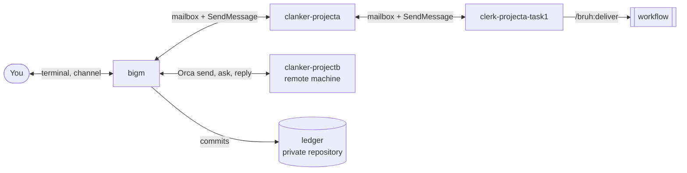

<p align="center">
  
</p>

<p align="center">
  <a href="https://github.com/oter/bruh/actions/workflows/ci.yml"></a>
  <a href="https://github.com/oter/bruh/releases/latest"></a>
  <a href="LICENSE"></a>
  <a href="https://scorecard.dev/viewer/?uri=github.com/oter/bruh"></a>
</p>

# bruh

bruh is a Claude Code plugin. It lets one person run work in many projects on many machines through a hierarchy of Claude Code sessions.

You talk to one session, bigm. bigm keeps the status of all work in a private ledger repository and answers your questions about it. It shows you only the questions that need you. bruh runs with a human, or fully autonomous. It runs the same way on a local machine and in a container.

## Roles

| Role | Lifetime | Started by | Scope | Does hands-on work |
|---|---|---|---|---|
| bigm | Long-lived | You | All projects. Keeps the ledger and the "Owed to owner" list. | No |
| Clanker | Long-lived | bigm | One project. Knows the full picture of that project. Divides the work into tasks. | No |
| Clerk | One task | A clanker | One task. Starts workflows, pushes the branch, and reports with evidence. | No |
| Workflow | One run | A clerk | One step of a task: plan, implement, review, and fix. | Yes |

Each role runs as a plugin agent (`bruh:bigm`, `bruh:clanker`, `bruh:clerk`). The work runs in the `/bruh:deliver` workflow.

## How it works



- A local message goes to the durable mailbox of the bruh MCP server. A `SendMessage` nudge carries only its header line.
- Each question has a priority. A clanker answers P2 questions from the project context. P1 questions (your decisions) and P0 questions (blocks that only you can remove) go to bigm, and bigm shows them to you.
- Each role stays below about 55 percent of its context window. A hook tells the role to write its handoff before compaction, and another hook gives the handoff back after compaction.
- A remote clanker talks to bigm through the Orca remote runtime.

The full process is in [docs/flow.md](docs/flow.md) as diagrams.

## Install

Steps 4, 5, and 6 are optional. Create the ledger repository (step 3) before you answer question 2 of the init skill.

### 1. Install the plugin

```bash
claude plugin marketplace add oter/bruh
claude plugin install bruh@bruh
```

Install at user scope, so that all your projects get the plugin.

### 2. Run the init skill

In a Claude Code session, run:

```text
/bruh:init
```

The skill asks one question for each message: how bruh addresses you, the ledger path, the mode (human or autonomous), the P1 batch interval and size, the review-round cap, the auto-compact window, the handoff threshold, the concurrency cap, the status line tap, the channels, the delegated P1 classes, the merge grants, and the remote machines. Before it writes a settings file, it shows the diff and waits for your yes.

The skill lists the project folders that need workspace trust. Start `claude` once in each of these folders and accept the trust dialog. `claude --bg` refuses a folder that is not trusted.

Non-interactive form, for a container or a script: write the answers to a JSON file, then run the init command of the MCP server. `<plugin root>` is the folder of the installed plugin, `~/.claude/plugins/cache/bruh/bruh/<version>`. The MCP tool `bruh_info` also gives it.

```json
{
  "user_name": "<how bruh addresses you>",
  "ledger_path": "/path/to/ledger",
  "mode": "human",
  "p1_batch_minutes": 60,
  "p1_batch_size": 5,
  "review_round_cap": 2,
  "auto_compact_window": 550000,
  "handoff_percent": 50,
  "max_busy_clerks": 8,
  "wrap_statusline": true,
  "channels": [],
  "delegated_p1_classes": [],
  "merge_grants": [],
  "remote_environments": []
}
```

```bash
GOTOOLCHAIN=local go run -C <plugin root>/mcp . init --answers answers.json
```

Only `user_name` and `ledger_path` are required. The other keys have the default values that the example shows. Instead of a file, you can set each key as an environment variable `BRUH_INIT_<KEY>`, for example `BRUH_INIT_USER_NAME`. The non-interactive form prints the diff instead of asking.

### 3. Create the ledger

The ledger is Markdown in a separate private repository. It describes all your other repositories. Create it, then give its path to the init skill (question 2):

```bash
gh repo create <owner>/<ledger repository> --private --clone
```

When the folder is empty, the init skill creates the layout: `README.md`, `mode.md`, `priorities.md`, `rules.md`, `grants.md`, `questions.md`, `owed.md`, `leases.md`, and `projects/`. bigm is the only writer of the ledger. The ledger clerk pushes it after each commit of bigm.

### 4. Set up a channel (optional)

A channel sends P0 and P1 questions to your phone. A channel runs only when bigm starts with `--channels`.

Telegram uses the official channel plugin, which needs [Bun](https://bun.sh). Create a bot with BotFather and copy its token. Then, in a Claude Code session:

```text
/plugin install telegram@claude-plugins-official
/telegram:configure <token>
```

Start bigm with `--channels plugin:telegram@claude-plugins-official` (step 7). Send a message to your bot, then pair your account and allow only yourself:

```text
/telegram:access pair <code>
/telegram:access policy allowlist
```

Slack is a custom channel in bruh. During the channels research preview, a custom channel loads only with a development flag. Start bigm with `--dangerously-load-development-channels plugin:bruh@bruh` instead of the Telegram `--channels` value.

### 5. Add a remote machine (optional)

On the remote machine:

1. Install Claude Code, then do steps 1 and 2.
2. Start the Orca runtime on an address of a private network, for example a VPN address:

   ```bash
   orca serve --pairing-address <private network address>
   ```

   The command prints the pairing status and a pairing code, a link that starts with `orca://pair`.

On the machine of bigm, pair the runtime once:

```bash
orca environment add --name <environment name> --pairing-code <pairing code>
```

Give the environment name to the init skill (question 13). For remote work, run bigm in an Orca terminal.

### 6. Run in a container (optional)

For autonomous work, the container image is `ghcr.io/oter/autonomous-agents/agent`. The image is outside this repository.

Put the plugin data folder on a volume. Without a volume, the handoffs, the mailboxes, and the leases are lost when the container stops.

```bash
docker volume create bruh-data
docker run -it -v bruh-data:<home folder of the container user>/.claude/plugins/data \
  ghcr.io/oter/autonomous-agents/agent
```

In the container, do step 1, then the non-interactive form of step 2. In a container, bigm has no Orca terminal. To reach a remote clanker in a container, run `orca serve` in that container (step 5).

### 7. Start bigm

Start bigm in the folder of your ledger repository:

```bash
claude --agent bruh:bigm --name bigm --permission-mode auto \
  --settings ~/.claude/plugins/data/bruh-bruh/roles/bigm.json \
  --channels plugin:telegram@claude-plugins-official
```

Remove the `--channels` line when you use no channel. `~/.claude/plugins/data/bruh-bruh/` is the plugin data folder of the plugin `bruh@bruh`. bigm stays an interactive session. Do not start it with `--bg`.

bigm starts a clanker for each project that has work. Tell bigm what to do.

### 8. Check the requirements

| Requirement | Why |
|---|---|
| Claude Code 2.1.284 or later | The version that the probes of this release ran on |
| Go 1.26 or later | Claude Code starts the bruh MCP server with `go run` |
| `jq` | The hook scripts |
| `git` | Worktrees, branches, and the ledger |
| Orca | Remote machines only |
| Bun | The Telegram channel plugin only |
| macOS or Linux | Native Windows is not supported |

Background sessions use the Claude account of the Claude Code supervisor. bruh never sets `CLAUDE_CONFIG_DIR`.

> [!WARNING]
> A plugin that adds text at session start (a `SessionStart` hook with `additionalContext`) adds that text to every role session: bigm, each clanker, and each clerk. bruh starts many sessions, so the cost is multiplied. Run `claude plugin list` and disable the plugins that the roles do not need.

## Documentation

- [Specification](docs/spec.md): what bruh does, and the tag of each decision.
- [Flow](docs/flow.md): the process as diagrams.
- [Design](docs/design.md): what the owner said, and the decision log.
- [Knowledge](docs/knowledge.md): the verified facts about Claude Code and Orca, and the probe results.
- [Smoke test](tests/smoke/README.md) and [load test](tests/load/README.md).
- [Changelog](CHANGELOG.md), [contributing](CONTRIBUTING.md), and [security policy](SECURITY.md).

## License

[Apache-2.0](LICENSE).
