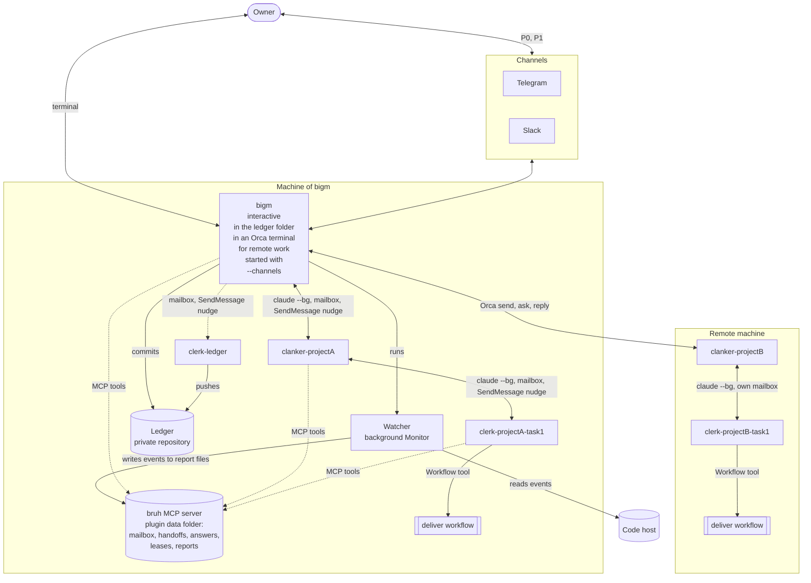
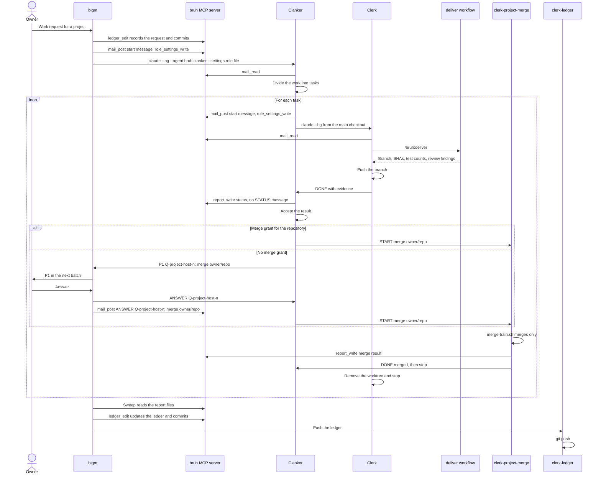
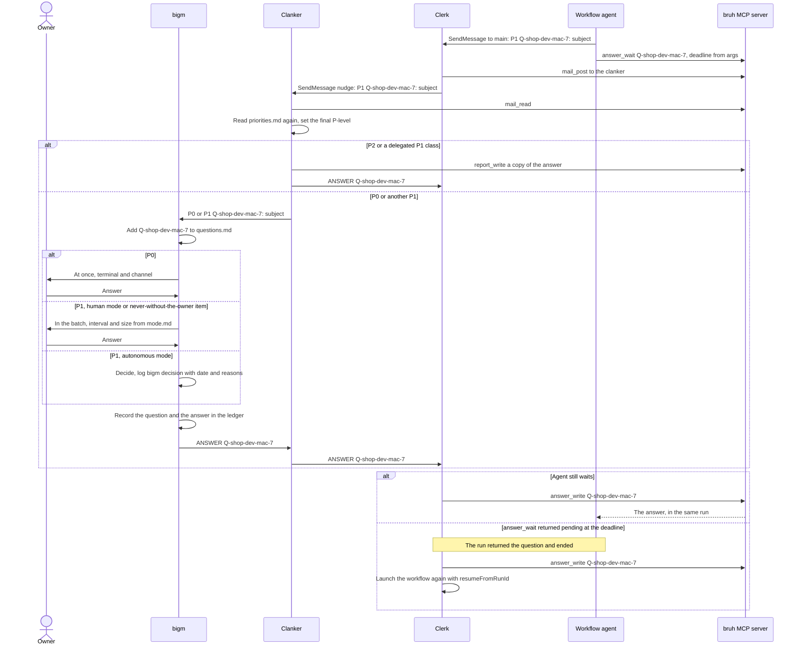
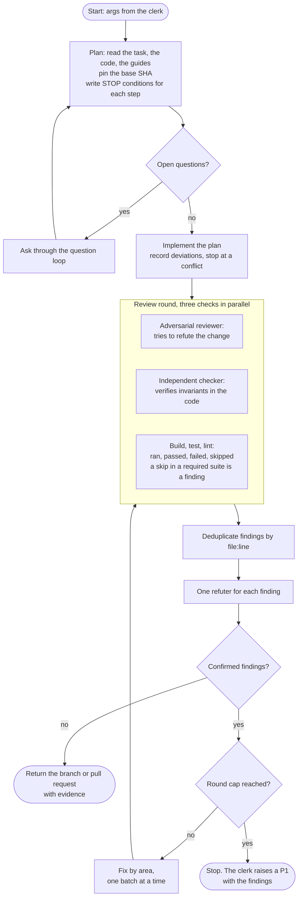
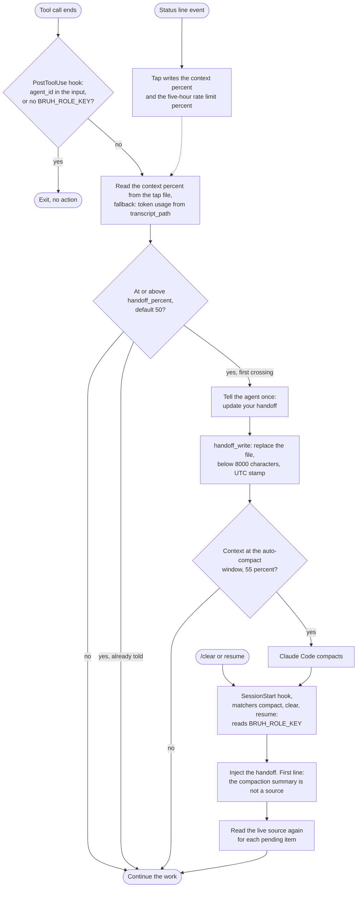
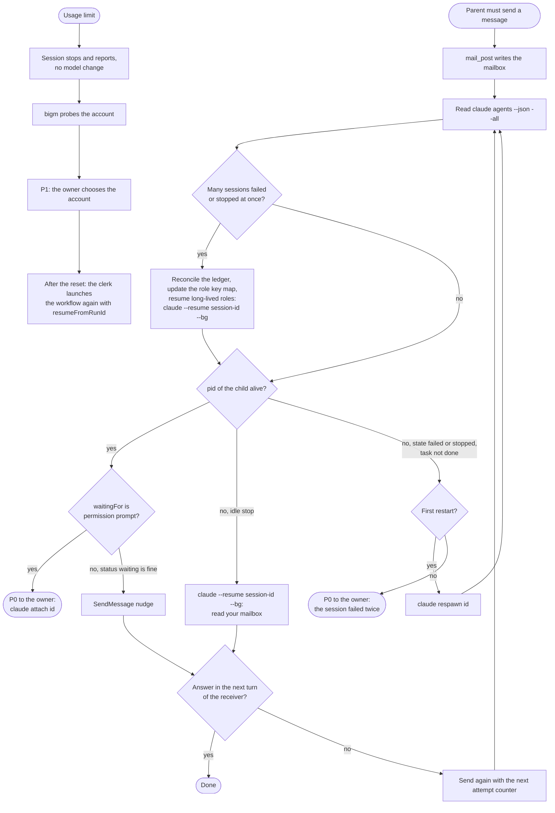
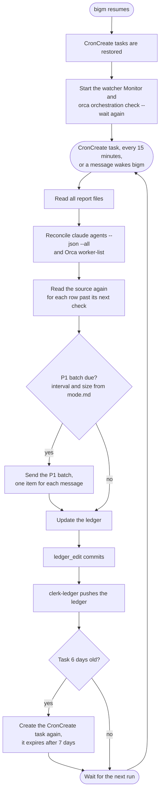

# bruh flow

This file shows the process of bruh as diagrams. It matches [spec.md](spec.md) version 0.4. When this file and the specification differ, the specification is correct.

The diagrams:

1. [Topology](#1-topology): the sessions, the files, and how they connect.
2. [Task lifecycle](#2-task-lifecycle): one task from the owner to a delivered and merged branch.
3. [Question loop](#3-question-loop): how a question goes up and how the answer comes back.
4. [Delivery loop](#4-delivery-loop): the steps of the `deliver` workflow.
5. [Context loop](#5-context-loop): how each session stays below 55 percent of its context window.
6. [Liveness and failure loop](#6-liveness-and-failure-loop): how a parent finds and restarts a stopped session.
7. [Sweep loop](#7-sweep-loop): the recurring task of bigm that keeps the ledger true.

## 1. Topology

Local sessions talk through the mailbox of the bruh MCP server plus a `SendMessage` nudge. A remote clanker talks to bigm only through Orca, because the mailbox is on one machine. The remote clanker uses the mailbox of its own machine for its clerks.

## 2. Task lifecycle

Each start writes a start message to the mailbox and a role settings file, then runs `claude --bg`. Routine status goes to report files, not to messages. A merge is a P1 `P1 Q-project-host-n: merge?` to the owner, unless a merge grant covers it. A merger clerk `clerk-<project>-merge` does each merge in a new session and stops. For a remote project, bigm starts the merger on its own machine. `mail_post` accepts messages only between a parent and its child, from bigm, and a P0 from a clerk to bigm.

## 3. Question loop

A question goes up until a role can answer it. A clanker answers P2 and the delegated P1 classes. Items of the never-without-the-owner list always go to the owner, also in autonomous mode.

A message cannot approve a permission prompt. So a P0 for a prompt carries the command `claude attach <id>`, and the owner answers in that session.

## 4. Delivery loop

Each review diffs against the pinned base SHA. A finding that the refuter does not confirm stays refuted. The round cap comes from `args`, with default 2.

## 5. Context loop

The status line tap and the hooks are plugin code, and they write only in the plugin data folder. A hook does nothing in a subagent or in a session without `BRUH_ROLE_KEY`.

## 6. Liveness and failure loop

A parent checks a child before each nudge. A reboot check comes first, because after a reboot many sessions show as `failed` or `stopped` at the same time. A `status` of `waiting` means between turns, not stuck.

## 7. Sweep loop

bigm runs the sweep as a recurring `CronCreate` task, and a message wakes it sooner. A `Monitor` and a background command are not restored on resume, so bigm starts them again.

